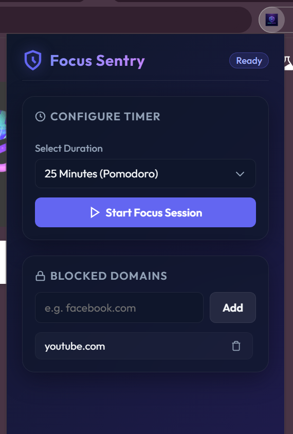
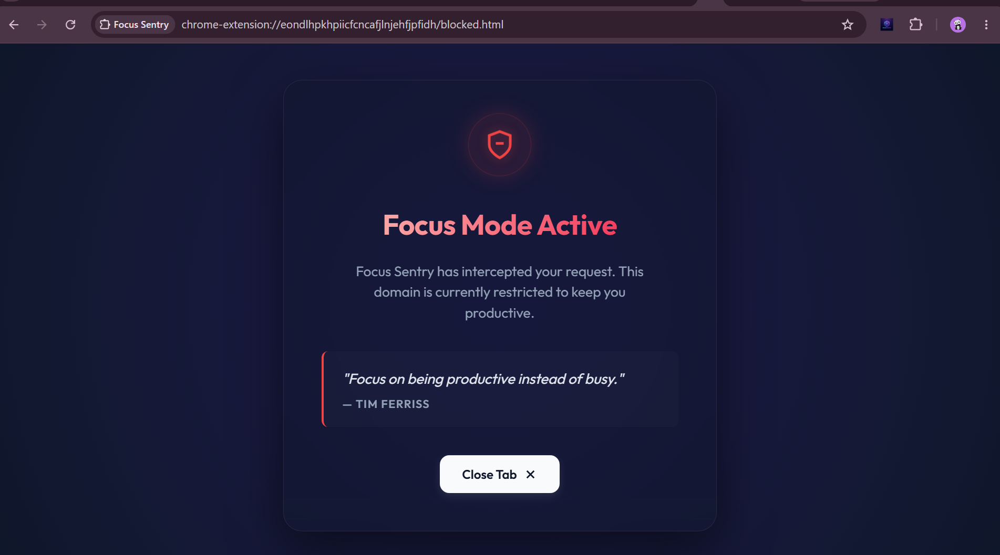
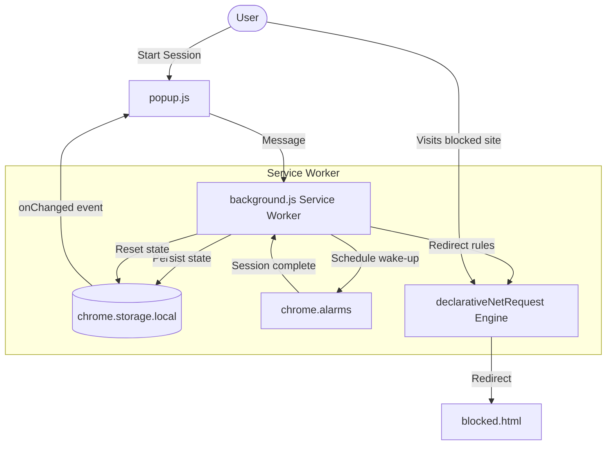

# Focus Sentry 🛡️⏳

A premium Manifest V3 Chrome Extension that blocks distracting websites to keep you focused. Built with a glassmorphic dark-mode interface and an event-driven background service worker.

## 📸 Previews

<p align="center">
  
  &nbsp;&nbsp;&nbsp;&nbsp;
  
</p>

---

## ⚡ Tech & Architecture highlights

* **High Performance**: Uses `chrome.declarativeNetRequest` to delegate URL redirection to Chrome's native C++ engine (zero runtime content script overhead).
* **Resource Efficient**: Uses `chrome.alarms` to schedule session limits, allowing the background service worker to suspend itself during focus sessions to save RAM.
* **Reactive State**: Decoupled state sync between the background worker and popup UI using `chrome.storage` events.
* **Self-Healing Lifecycle**: Automatically cleans up blocking rules on browser startup if the timer wasn't running, ensuring users are never locked out after a crash.

---

## 🛠️ Tech Stack

* **Frontend**: HTML5, Vanilla CSS3 (HSL Variables, Flexbox, SVG animations), ES6+ JS.
* **Browser APIs**: `declarativeNetRequest`, `alarms`, `storage`, `runtime`.

---

## 📐 Architecture & Data Flow



---

## 📁 File Structure

```text
├── manifest.json       # Metadata & permissions declarations (MV3)
├── background.js      # Service worker & lifecycle manager
├── popup.html         # Setup dashboard UI
├── popup.css          # Glassmorphic dark UI styles
├── popup.js           # Popup controller & countdown state
├── blocked.html       # Interception splash page
├── blocked.css        # Interception splash page styles
└── icons/             # Sleek branding assets (16px, 48px, 128px)
```

---

## 🚀 Quick Start

1. Open `chrome://extensions/` in Google Chrome.
2. Enable **Developer mode** (top-right).
3. Click **Load unpacked** (top-left) and select the `focus-sentry` directory.
4. Pin the extension, add a website, and start focusing!
